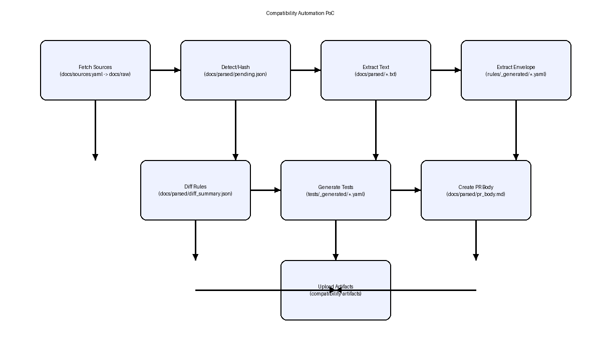

# compatibility-automation-poc
Deterministic, auditable compatibility automation for RHEL 8 / Veritas 8.0.x kernel envelopes.

## What this PoC does
- Fetch vendor evidence (HCL / release notes) into `docs/raw` (via configured URLs).
- Extract text deterministically, derive kernel envelope (min/max) only when explicitly stated.
- Compare generated rules to the baseline, classify safety (narrow/widen/ambiguous/missing evidence).
- Generate test cases and a PR body; upload artifacts for review.

## Flow (diagram)


```
GitHub Actions (manual or scheduled)
	|
	|-- Fetch sources -> docs/raw/*.pdf|html|txt
	|-- Detect changes (hash) -> docs/parsed/pending.json
	|-- Extract text -> docs/parsed/*.txt + manifest
	|-- Extract envelope -> rules/_generated/*.yaml (explicit bounds only)
	|-- Diff rules vs baseline -> docs/parsed/diff_summary.json (gating)
	|-- Generate tests -> tests/_generated/*.yaml
	|-- Create PR body -> docs/parsed/pr_body.md (gate: block/allow/info)
	|-- Upload artifacts -> compatibility-artifacts (parsed, rules, tests)
```

## Key inputs
- `docs/sources.yaml` (planned): list of vendor URLs to fetch (type, name, url).
- `docs/raw/`: raw vendor files (pdf/html/txt) if added manually.
- `rules/veritas_802_rhel8.yaml`: baseline envelope for comparison.

## Key outputs
- `rules/_generated/*.yaml`: extracted envelopes from new evidence.
- `docs/parsed/diff_summary.json`: gating decisions (widen -> block; narrow/high-confidence -> allow; ambiguous -> block).
- `docs/parsed/pr_body.md`: markdown summary for PRs.
- `tests/_generated/*.yaml`: GO/NO_GO cases derived from envelopes.
- Workflow artifact: `compatibility-artifacts` containing parsed docs, summaries, generated rules/tests.

## Workflow steps (GitHub Actions)
1) Checkout
2) Set up Python 3.11
3) Install deps (`pip install pyyaml requests` once fetch step is added)
4) Fetch sources (planned): download URLs from `docs/sources.yaml` into `docs/raw`
5) Detect changes: hash raw docs, record pending
6) Extract text: deterministic extraction to `docs/parsed`
7) Extract envelope: accept explicit min/max only; mark ambiguous otherwise
8) Diff rules: classify widening/ambiguous/low-confidence as `pr_block_auto_merge`
9) Generate tests: build GO/NO_GO cases from envelopes
10) Create PR body: summarize decisions and evidence
11) Upload artifacts: `docs/parsed`, `rules/_generated`, `tests/_generated`

## Run locally
```bash
python -m pip install -r requirements.txt  # or pip install pyyaml requests
python scripts/fetch_sources.py            # when sources.yaml is present
python scripts/detect_changes.py
python scripts/extract_text.py
python scripts/extract_envelope.py
python scripts/diff_rules.py
python scripts/generate_tests.py
python scripts/create_pr.py
```

## Adding vendor sources (planned)
Create `docs/sources.yaml`:
```yaml
sources:
	- name: veritas_hcl_feb2026
		url: https://example.com/veritas_infoscale_802_rhel8_hcl.pdf
		type: vendor_hcl
	- name: veritas_rn_feb2026
		url: https://example.com/veritas_infoscale_802_rn.html
		type: release_notes
```
The fetch step (to be added) will download each URL to `docs/raw/<name>.<ext>` and log hashes.

## Safety and gating
- No envelope widening auto-merges; ambiguous or low-confidence changes block auto-merge.
- Only explicit bounds on the same line as support statements are accepted; otherwise flagged ambiguous.
- Evidence, hashes, and summaries are uploaded as artifacts for audit.

## Current status
- Workflow runs end-to-end and uploads artifacts.
- With only placeholder `.gitkeep`, generated rule is ambiguous and blocks auto-merge.
- Next: add `docs/sources.yaml` and `scripts/fetch_sources.py`, then rerun with real vendor docs.
